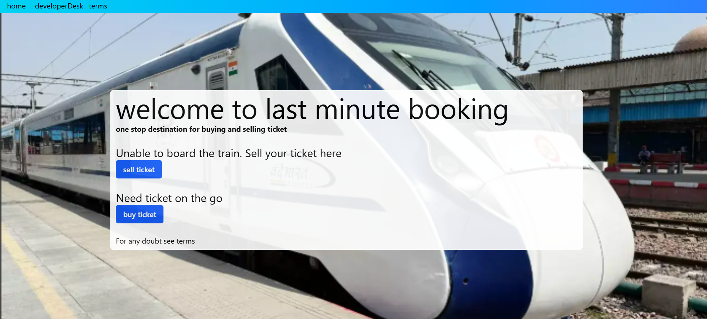
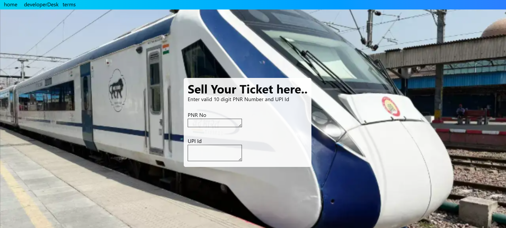
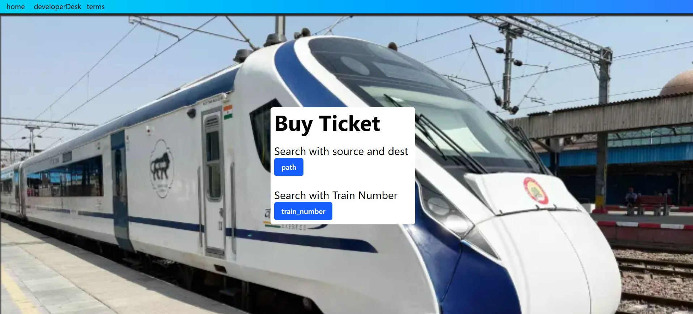
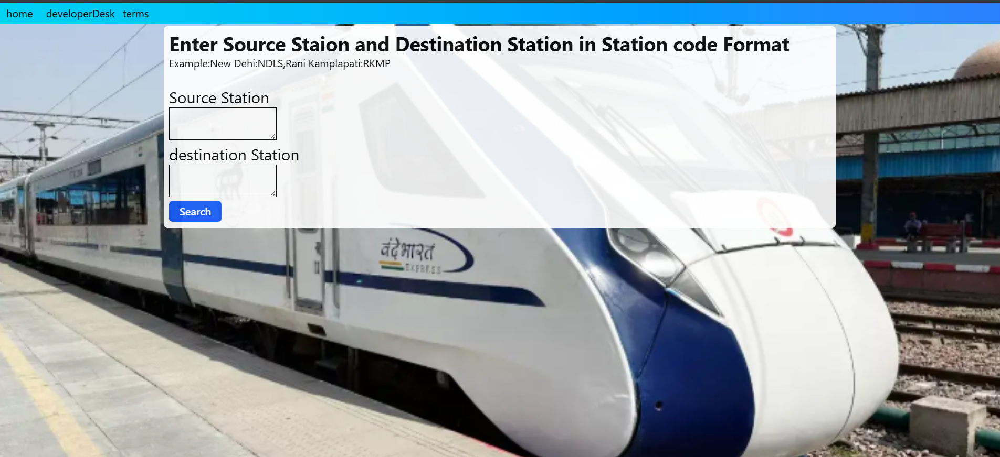

## Last Minute Booking
A platform that allows user to sell or buy ticket at the last moment


## Features

- **Sellers** sell their ticket
- **Buyers** can buy ticket using **train number** or **source and destination**
- **Stripe** for payment
- **MongoDB** for database


## Tech Stack

**Client:** React, TailwindCSS

**Server:** Node, Express

**Database:** MongoDB

**Deployment**: Render


## Description

Allows user to sell their ticket online if they are not able to bored for some reasons. 
Person can buy the ticket if they are not able to book due to unavailability of tickets at the last moment.
for this it uses PNR number verification as PNR number is unique, if the details are correct the ticket is stored in the database. 
Person who want to buy ticket can buy by entering train number or the source and destination tickets if the train ticket is available he/she can pay online. 
after that it displays the PNR Number.


## Screenshots
### Home Page


### Sell Ticket Page



### Buy Ticket Page



### Buy with Path Page


### Buy with Train Number Page


## Deployment

To deploy this project run

```bash
  git clone https://github.com/aerenyeger/last_minute_booking.git
```
```bash
  cd last_minute_booking
```
for **frontend**
```bash
  cd last_minute_booking
```
```bash
  npm i
```
```bash
  npm run dev
```
for **backend**, 
in a new terminal

```bash
  cd bd_last_minute_booking
```
```bash
  npm i
```
```bash
  node index.js
```


## Demo
the demo is live on **Render**.
API calls may take upto 60 Seconds

https://last-minute-booking-frontend.onrender.com

